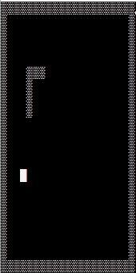
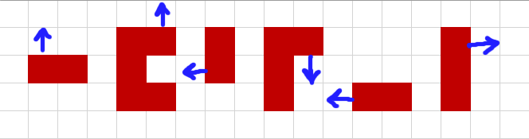
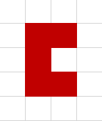
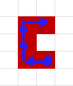
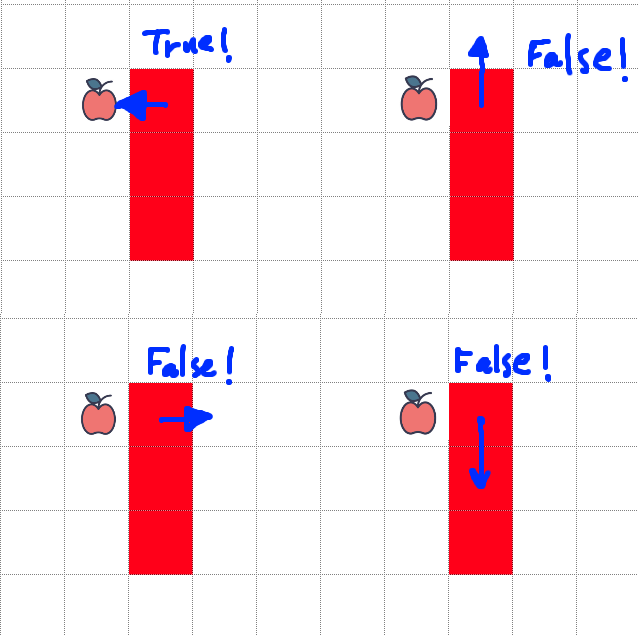
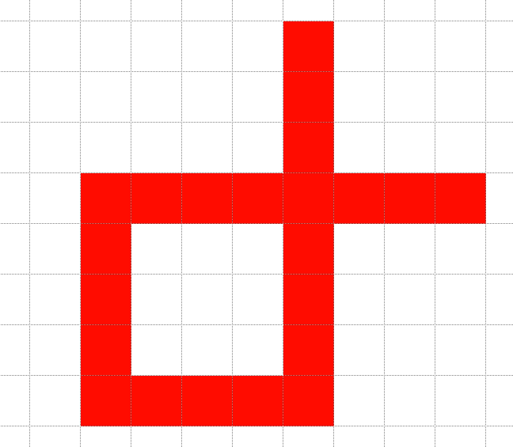

# A Snake Game!



Let’s code a Snake game! The snake eats and grows, how big will it get before it bumps into a wall or itself?

## Step 0: Getting ready


First Download the [Snake Game Code](SnakeGame_LF.zip), and open the project, where you’ll have:

1. **Questions:** The logic behind the snake itself🐍consists of two files: `snake.h` and `snake.c`.  
    The `snake.h` file already contains the function declarations, you’re task is to fill in the `snake.c`.

2. **Tests**: (Almost) As usual.  
    You would like to test your code after every step.  
    (I’ll be explicit here: once you implemented a function, run the relevant unit tests and see if they pass, don’t move on as long as you didn’t finish with the current function)  
    Hence you have several test suites. Every test suite is located in a separate file.  
    Open `Evaluator.c`. You will see that the different unit test suites are imported with `IMPORT_TESTS` macro and run with `RUN_TESTS` macro.  
    Every time you reach a step below, uncomment the relevant `RUN_TESTS` lines in the `main()` function.  
    This way, you gradually enable the required tests as you go. 

3. After you finish with all the unit tests, you'll be able to leave just the last one: `run_snake_t`est (that actually runs the game instead of testing)

## **Step 1: The birth of a snake**

When the snake is born, it has only one link.  
Implement the functions for creating and freeing a snake.  
Note that in the code, `uint8_t **` is replaced by `snake_t` (via a `#define` statement).

```c
// Creates a snake in coordinate (x,y): 
uint8_t ** create_snake(uint8_t x, uint8_t y);  
// Free snake’s memory (remember: it’s a double pointer array!)  
void free_snake(uint8_t ** snake, size_t snake_size);
```

## **Step 2: Where to crawl**

At any given moment, the snake can move (or grow) in one of four directions `{UP, DOWN, LEFT, RIGHT}`;  
Hence I defined an enum to hold the possible directions.  
For ease of notation, I’ve defined this enum type to be called `direction_t`:

```c
enum directions_enum {UP, DOWN, LEFT, RIGHT};  
#define direction_t enum directions_enum
```
_This step was done for you, find it in the right file and make sure you understand it._

 
## **Step 3: Getting bigger**

Let’s write a function that grows the snake in a given direction!  
This function should modify the snake array. In fact, it should reallocate it.  
Therefore, the snake is an input-output parameter of this function (it’s an input, but it’s also an output since it’s modified inside).  
And for modifying a variable inside a function we need to pass a pointer to that variable, right?  
Well, the snake is of type `uint8_t **`, which means that the function will receive... oh no... can’t be... a triple pointer 😲
```c
size_t grow_snake(uint8_t*** snake_ptr, size_t snake_size, direction_t direction);
```
For the sake of readability, let’s define `snake_t` to be `uint8_t**` :
```c
#define snake_t uint8_t **
```
The function signatures now change into:
```c
snake_t create_snake(uint8_t x, uint8_t y);  
void free_snake(snake_t snake, size_t snake_size);  
size_t grow_snake(snake_t * snake_ptr, size_t snake_size, direction_t direction);
```
Much nicer, no?

This function has a test: `grow_snake_test`. Use it!

### **Hints and instructions!**

1.  Use the realloc function to grow the snake! Look up “**[C realloc and calloc documentation](realloc%20and%20calloc%20documentation.pdf "C realloc and calloc documentation")**” .

2.  `snake_t` is an array of pointers. This means that the i-th link of `snake_t snake` is simply `snake[i]`, and that the x and y coordinates of this link are `snake[i][0]` and `snake[i][1]` accordingly.

3.  Put the head at the last element. Meaning, if snake is now of size 5, the head should be at `snake[4]`.

4.  Don’t move on till your current test passes!


## **Step 4: Moving around**

The game loop will move the snake at every iteration. Write a function that moves the snake:
```c
void move_snake(snake_t snake, size_t snake_size, direction_t to_where);
```
As before, this function is testable. So go ahead and take a look at `move_snake_test` in your test project, make sure it passes 😊


## **Step 5: Improving the moving around test**

If you look inside `move_snake_test`, you’ll find several “empty” unit tests. Those unit tests are waiting for you:
Read the instructions below regarding the auxiliary functions, and then add unit tests to test the following initial snake positions (not just a single coordinate):



For writing those unit tests, you will use two auxiliary functions located at `snake.c` (already implemented)

### **First auxiliary function: `create_long_snake`:**
```c
// initializes a snake with tail in (x,y), that grows from it  
// by the supplied directions:  
snake_t create_long_snake(uint8_t x, uint8_t y, direction_t * growth_directions, size_t num_growth_directions);
```
For example, in order to create the following shape:



I can do the following:
```c
direction_t growth_directions [] = { LEFT, UP, UP, RIGHT };
snake_t = create_long_snake(10,10, growth_directions, num_growth_directions);
```



**Note:** `create_long_snake` uses `grow_snake`, a function that you implemented. We know that `grow_snake` works – you tested it with the unit tests of `grow_snake_test`.  
However, who says that `create_long_snake` works? Maybe some bug sneaked in? Hence, please make sure `create_long_snake_test`  passes before moving on.

### **Second auxiliary function: `are_snakes_equal`:**
```c
// Returns true if snakes are of the same length and have exactly  
// the same coordinates in every link.  
bool are_snakes_equal(snake_t a, size_t a_size, snake_t b, size_t b_size);
```
This function of course has a unit test. Its unit tests use `create_long_snake`… that you just made to work recently.  
So, now you should enable `are_snakes_equal_test` and verify it works  
(Isn't that great? We just build our code step by step, each time relying on something we know that works !)

### **Back to testing `move_snake`:**

Add the required tests to `move_sanke_test` by utilizing `create_long_snake` and `are_snakes_equal` for creating and verifying the snake shapes described in the drawing above :)


## **Step 6: Eating. How will it grow if it won’t eat?!**

Food takes a single coordinate on the screen. So, food is a one-dimensional array of size 2: `uint8_t food[2] = {x, y}`.

Implement a function that checks if the snake will reach the food on the next move:
```c
// Returns true if snakes will reach food after a single move in the  
// given direction.  
bool will_snake_reach_food_on_next_move(snake_t snake, size_t snake_size, uint8_t * food, direction_t direction);
```
_Remember, food is always of size 2, so there’s no need to get its size as input_

Of course, test your function in `snake_reaches_food_test`, for the following situations, and see if they pass!



## **Step 7: Drawing**

You have `draw_at_xy(...)` function defined in `snake.c` that draws a certain character at a certain x,y location in the console  
(a character can be a single letter like `O` or `S` , it can be a sign like `@` or even a space ` `, or, it can be special characters such as `▓` that have a special code, as described below)

Even though the colors of the snake etc. were chosen for you at `snake.h` (see the `#define` statements there), you can choose to change those colors.

The special color codes are:

```html
176 ░

177 ▒

178 ▓

219 █
```
### Notes:

1. On some platforms, `176` and `177` are not noticed.  
2. If you want to experiment, just open `notebook` , hold down the alt key, hit the numbers: 1,7,9, and then free the alt key.

Go ahead and implement:
```c
void draw_snake(snake_t snake, size_t snake_size)  
void clear_snake(snake_t snake, size_t snake_size)  
void draw_food(uint8_t * food)
```
Those functions do not have unit tests. You can check if they work by enabling the `run_snake_test` at `Evaluator.c`.

## **Step 8: Setting a new food location**

Implement the following function, which should place (randomly) a new food on the board. to choose a random location, read the **[C rand Function Documentation](https://codallehmoodle.online/mod/page/view.php?id=317 "C rand Function Documentation")**.

```c
void set_new_food_location(snake_t snake, size_t snake_size, uint8_t food[2]);
```
###### Make sure the new food doesn’t “land” on the snake. Implement an auxiliary function for that:

```c
bool is_food_on_snake(snake_t snake, size_t snake_size, uint8_t food[2]);
```
###### Use this auxiliary function inside set_new_food_location to check if is the function returns true – set a new location for the food... And so on...

## **Step 9: Loosing**

Well, you didn’t really think I’d let you just eat forever, did you?
We need to test when the snake bumps into walls or into itself.
Let's start with bumping into itself:
```c
// Returns true if snakes will bump into itself after a single move in // the given direction.  
bool will_snake_collide_with_itself_on_next_move(snake_t snake, size_t snake_size, direction_t direction);
```
Of course, we must test it! Please enable `collision_with_itself_test`.

You can modify the test to try and cover other scenarios.  
you don’t have to test cases that shouldn’t occur in reality, like this:



Now let's add checks of collision with walls.

The drawing of the walls is implemented for you at:

```c
 void draw_borders();
 ```

Take a look again at the `#defines (GAME_WIDTH / HEIGHT / WALL_COLOR)` at the top of `snake.h`. you can play with the numbers and see what comes out 🔢

(you can check by running the game, no unit tests here)

Got it? great, it's time to check snake collision with borders:
```c
bool will_snake_collide_border_on_next_move(snake_t snake, size_t snake_size, direction_t direction);
```
Run unit tests (the `collision_with_itself_test`)!

Also, one last thing:

Snake can’t move in the direction straight opposite to where it's heading right now. No 180 turns ... 😉

I'm using the following function in the main game loop to check it, please implement it:
```c
bool can_snake_move_in_direction(direction_t current_direction, direction_t requested_direction)
```
(Enable `can_snake_move_in_direction_test` to test yourself)

## **Step 10: Have fun**

**Running The Game:** Finally, at `Evaluator.c`, uncomment the `run_snake_test` suite and comment out the others to run the game😊

## Requested files

`snake.c`